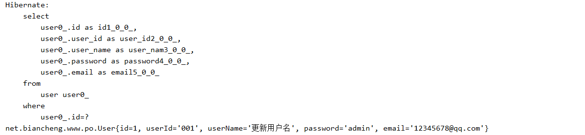
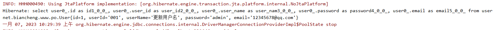

###
```shell
http://c.biancheng.net/hibernate/first-example.html
```
#### 创建数据库表
```mysql
DROP TABLE IF EXISTS `user`;
CREATE TABLE `user` (
`id` int NOT NULL AUTO_INCREMENT,
`user_id` varchar(255) DEFAULT NULL,
`user_name` varchar(255) DEFAULT NULL,
`password` varchar(255) DEFAULT NULL,
`email` varchar(255) DEFAULT NULL,
PRIMARY KEY (`id`)
) ENGINE=MyISAM AUTO_INCREMENT=3 DEFAULT CHARSET=utf8mb4;

INSERT INTO `user` VALUES ('1', '001', 'admin', 'admin', '12345678@qq.com');
INSERT INTO `user` VALUES ('2', '002', 'user', '123456', '98765432@qq.com');
```
#### 核心配置文件讲解
* 默认sql格式打印```<property name="hibernate.format_sql">false</property>```
---

* 格式化sql格式打印```<property name="hibernate.format_sql">true</property>```
---

* 控制台打印sql语句```<property name="hibernate.show_sql">true</property>```